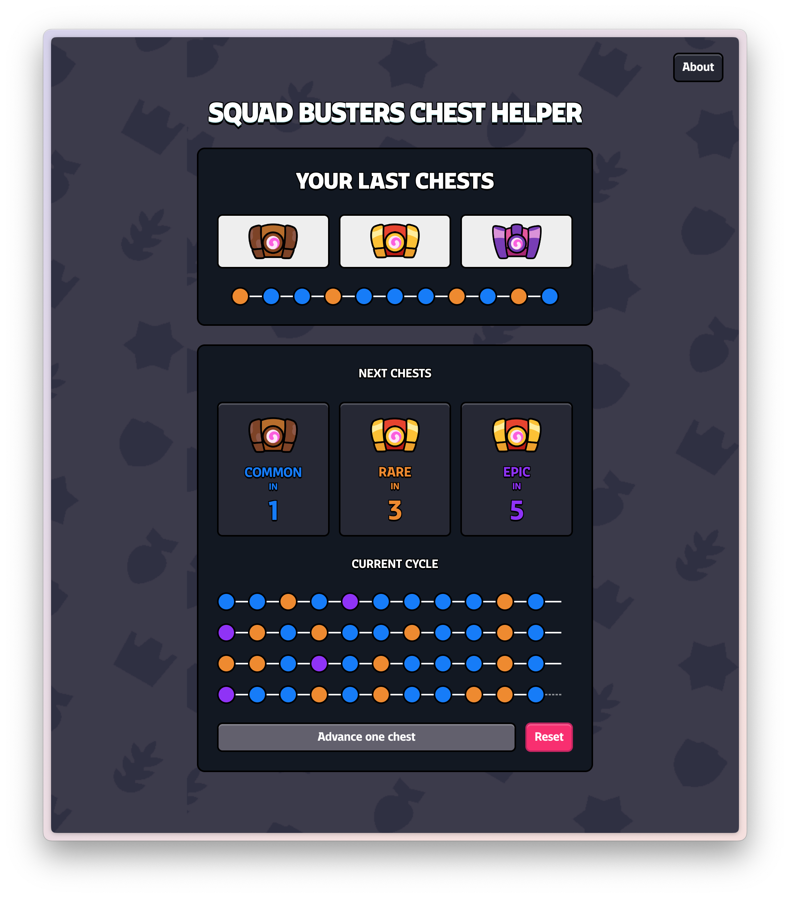

<p align="center"></p>

# Squad Busters Chest Helper

## Description

A simple tool to keep track of your chests cycle in Squad Busters.

## Usage

Stack: Vue 3, Vite, Tailwind CSS.

### Development

```bash
npm install
npm run dev
```

Open the link provided by Vite in your browser.

ESLint is configured in the project. You can run it with:

```bash
npm run lint
```

### Build

```bash
npm run build
```

The build will be in the `dist` folder.
